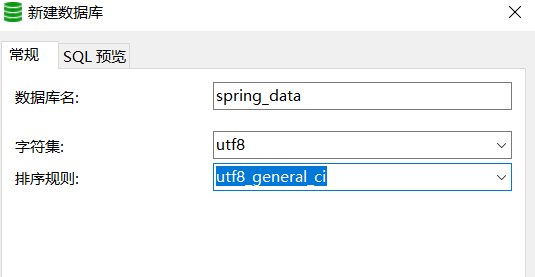
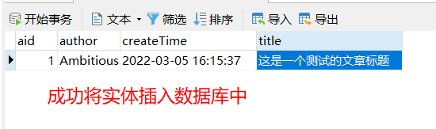
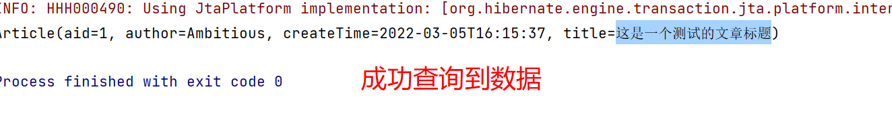
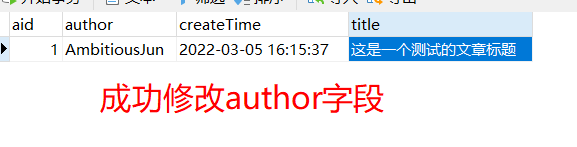
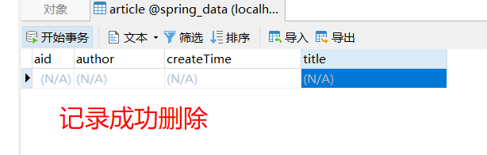

## 1. JPA基础

JPA的全称是Java Persistence API， 即Java持久化API， 是sun公司推出的一套基于ORM的规范， 注意不是ORM框架——因为JPA并未提供ORM实现，它只是提供了一些编程的API接口。

## 2. JPA实战

搭建jpa环境，实现一条数据的增删改查

### 2.1 创建数据库环境

#### 2.1.1 创建MySQL数据库，起名为spring-data




#### 2.1.2 新建表，起名为article

```sql
create table `article` (
	`aid` int auto_increment primary key comment '主键',
	`author` varchar(255) default null comment '作者',
	`createTime` datetime default null comment '创建时间',
	`title` varchar(255) default null comment '标题'
)
```

### 2.2 创建Java工程，引入依赖

- mysql驱动
- hibernate（JPA只是提供了ORM接口，所以需要引入一个具体的ORM框架）
- Junit
- lombok

```xml
<dependencies>
        <!--MySQL-->
        <dependency>
            <groupId>mysql</groupId>
            <artifactId>mysql-connector-java</artifactId>
            <version>8.0.27</version>
        </dependency>
        <!--hibernate-->
        <dependency>
            <groupId>org.hibernate</groupId>
            <artifactId>hibernate-entitymanager</artifactId>
            <version>5.6.5.Final</version>
        </dependency>
        <!--Junit-->
        <dependency>
            <groupId>junit</groupId>
            <artifactId>junit</artifactId>
            <version>4.12</version>
            <scope>test</scope>
        </dependency>
        <!--lombok-->
        <dependency>
            <groupId>org.projectlombok</groupId>
            <artifactId>lombok</artifactId>
            <version>1.18.22</version>
        </dependency>
    </dependencies>
```

### 2.3 创建article实体类，并完成与数据表之间的映射

#### 2.3.1 创建实体类

```java
@Data
public class Article {

    private Integer aid;
    private String author;
    private LocalDateTime createTime;
    private String title;
}
```

#### 2.3.2 添加JPA注解，完成映射

- @Entity：标注该类是一个实体类，**必须添加，否则下面的注解无法生效**
- @Table：指定该实体类在数据库中的表名
- @Id： 指定主键子段
  - @GeneratedValue：指定主键生成策略
- @Column： 指定字段名称，当实体类属性名和表字段名一致时，可不用该注解

```java
@Data
@Entity
@Table(name = "article")
public class Article implements Serializable {

    @Id
    @GeneratedValue(strategy = GenerationType.IDENTITY)
    private Integer aid;
    @Column(name = "author")
    private String author;
    @Column(name = "createTime")
    private Date createTime;
    @Column(name = "title")
    private String title;
}
```

### 2.4 创建JPA配置文件

#### 2.4.1 在Maven工程中，JPA的配置文件指定为目录resources/META-INF下的persistence.xml文件

配置文件头：

```xml
<?xml version="1.0" encoding="UTF-8" ?>
<persistence xmlns="http://xmlns.jcp.org/xml/ns/persistence"
             xmlns:xsi="http://www.w3.org/2001/XMLSchema-instance"
             xsi:schemaLocation="http://java.sun.com/xml/ns/persistence http://java.sun.com/xml/ns/persistence/persistence_2_2.xsd"
             version="2.2">
</persistence>
```

#### 2.4.2 配置数据库连接信息

- persistence-unit：一个数据库连接使用一个persistence-unit标签进行配置

参数：

> name：持久化单元的名称，不与其他单元重复即可
>
> transaction-type：事务类型
>
> > JTA：分布式事务
> >
> > RESOURCE_LOCAL： 本地事务

- properties：配置连接属性（driver, url, username, password）
  - 可以进一步配置hibernate（本项目中的ORM实现框架是hibernate）
    - name: show_sql, value: boolean	【是否在控制台中显示SQL语句】
    - name: format_sql, value: boolean  【是否格式化输出的SQL语句】
    - name: hbm2ddl.auto 【是否自动建表】
      - value1: "update" 【当数据库存在表时，使用该表；没有表时，自动创建】
      - value2: "create" 【不管数据库有没有存在表，每次执行SQL都会重新创建，一般不使用】

- provider：可以配置一个JPA实现，当项目中只引入一个ORM框架时，该配置可省略
- class：实体类，配置项目中实体类的全包名，可以省略不配

配置完成之后如下代码所示：

```xml
<persistence-unit name="jpa01" transaction-type="RESOURCE_LOCAL">
    <!-- 提供商 -->
    <provider>org.hibernate.jpa.HibernatePersistenceProvider</provider>
    <!-- 实体类 -->
    <class>com.ambitious.jpa_preview.entity.Article</class>
    <!-- 数据库属性 -->
    <properties>
        <property name="javax.persistence.jdbc.driver" value="com.mysql.cj.jdbc.Driver"/>
        <property name="javax.persistence.jdbc.url" value="jdbc:mysql:///spring_data?serverTimeZone=Asia/Shanghai"/>
        <property name="javax.persistence.jdbc.user" value="root"/>
        <property name="javax.persistence.jdbc.password" value="cyj070723"/>
        <!-- 对于hibernate的详细配置 -->
        <property name="hibernate.show_sql" value="true"/>
        <property name="hibernate.format_sql" value="true"/>
        <property name="hibernate.hbm2ddl.auto" value="update"/>
    </properties>
</persistence-unit>
```

### 2.5 使用JPA接口实现简单的CRUD

- 通过 2.4 中配置的持久化单元的name属性值，获取EntityManagerFactory实例

- 使用EntityManagerFactory实例创建出EntityManager对象

  - **EntityManager对象是与数据库进行交互的核心对象**

  - 增：创建完实体类对象并赋值，调用EntityManager的persist( )方法即可插入数据库

  - 删：首先将要删除的记录从数据库**查询出来**，然后再调用EntityManager的remove( )方法进行删除

  - 改：将要修改的记录从数据库**查询出来**，然后再调用EntityManager的merge( )方法进行修改

  - 查：调用EntityManager的find( )方法，传入实体类字节码和主键子段值即可进行查询

- 操作完成之后，需要提交事务并且关闭资源

#### 2.5.1 在类属性中先实例化工厂

```java
public class JpaTest {
    
    private static final EntityManagerFactory factory = Persistence.createEntityManagerFactory("jpa01");
    
}
```

#### 2.5.2 增

```java
@Test
public void testSave() {
    // 获取EntityManager
    EntityManager manager = factory.createEntityManager();
    // 创建实体类对象并赋值
    Article article = new Article();
    article.setAuthor("Ambitious");
    article.setTitle("这是一个测试的文章标题");
    article.setCreateTime(LocalDateTime.now());
    // 获得事务对象，开始事务
    EntityTransaction transaction = manager.getTransaction();
    transaction.begin();
    // 保存实体类
    manager.persist(article);
    // 提交事务、关闭资源
    transaction.commit();
    manager.close();
}
```



#### 2.5.3 查

```java
@Test
public void testFind() {
    EntityManager manager = factory.createEntityManager();
    Article article = manager.find(Article.class, 1);
    System.out.println(article);
    manager.close();
}
```



#### 2.5.4 改

```java
@Test
public void testModify() {
    EntityManager manager = factory.createEntityManager();
    EntityTransaction transaction = manager.getTransaction();
    transaction.begin();
    // 首先将要修改的记录查询出来
    Article article = manager.find(Article.class, 1);
    // 进行修改，然后提交
    article.setAuthor("AmbitiousJun");
    manager.merge(article);
    transaction.commit();
    manager.close();
}
```



#### 2.5.5 删

```java
@Test
public void testDel() {
    EntityManager manager = factory.createEntityManager();
    EntityTransaction transaction = manager.getTransaction();
    transaction.begin();
    // 查询出要删除的记录
    Article article = manager.find(Article.class, 1);
    // 删除
    manager.remove(article);
    transaction.commit();
    manager.close();
}
```



