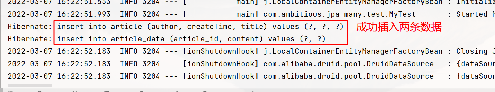

## 1. SpringDataJpa快速入门

### 1.1 数据库表

> 数据库表由JPA自动生成即可

### 1.2 创建Java工程，引入依赖

**Spring依赖必须和SpringDataJpa依赖适配，否则程序无法运行，可以查看SpringDataJpa依赖查看匹配的Spring版本号**

- JPA相关依赖
- Spring依赖
- SpringDataJpa依赖

```xml
<dependencies>
        <!--Junit-->
        <dependency>
            <groupId>junit</groupId>
            <artifactId>junit</artifactId>
            <version>4.12</version>
            <scope>test</scope>
        </dependency>
        <!--lombok-->
        <dependency>
            <groupId>org.projectlombok</groupId>
            <artifactId>lombok</artifactId>
            <version>1.18.22</version>
        </dependency>
        <!--hibernate-->
        <dependency>
            <groupId>org.hibernate</groupId>
            <artifactId>hibernate-entitymanager</artifactId>
            <version>5.6.5.Final</version>
        </dependency>
        <!--mysql-->
        <dependency>
            <groupId>mysql</groupId>
            <artifactId>mysql-connector-java</artifactId>
            <version>8.0.27</version>
        </dependency>

        <!--Spring-->
        <dependency>
            <groupId>org.springframework</groupId>
            <artifactId>spring-context</artifactId>
            <version>5.3.6</version>
        </dependency>
        <dependency>
            <groupId>org.springframework</groupId>
            <artifactId>spring-core</artifactId>
            <version>5.3.6</version>
        </dependency>
        <dependency>
            <groupId>org.springframework</groupId>
            <artifactId>spring-test</artifactId>
            <version>5.3.6</version>
        </dependency>
        <dependency>
            <groupId>org.aspectj</groupId>
            <artifactId>aspectjweaver</artifactId>
            <version>1.9.7</version>
        </dependency>

        <!--SpringDataJpa-->
        <dependency>
            <groupId>org.springframework.data</groupId>
            <artifactId>spring-data-jpa</artifactId>
            <version>2.5.0</version>
        </dependency>
    </dependencies>
```

### 1.3 创建实体类

```java
@Data
@Entity
@Table(name = "article")
public class Article implements Serializable {
    
    @Id
    @GeneratedValue(strategy = GenerationType.IDENTITY)
    private Integer aid;
    @Column(name = "author")
    private String author;
    @Column(name = "createTime")
    private LocalDateTime createTime;
    @Column(name = "title")
    private String title;
}
```

### 1.4 定义一个符合SpringDataJpa规范的Dao接口

- 继承两个接口
  - JpaRepository<T, ID>
    - T： 实体类
    - ID：实体类的主键类型
  - JpaSpecificationExecutor<T>
    - T： 实体类

```java
public interface ArticleDao 
extends JpaRepository<Article, Integer>, JpaSpecificationExecutor<Article> {
}
```

### 1.5 编写Spring配置文件，添加Jpa相关配置

```xml
<?xml version="1.0" encoding="UTF-8"?>
<beans xmlns="http://www.springframework.org/schema/beans"
       xmlns:jpa="http://www.springframework.org/schema/data/jpa"
       xmlns:context="http://www.springframework.org/schema/context"
       xmlns:xsi="http://www.w3.org/2001/XMLSchema-instance"
       xsi:schemaLocation="
       http://www.springframework.org/schema/beans http://www.springframework.org/schema/beans/spring-beans.xsd
       http://www.springframework.org/schema/context http://www.springframework.org/schema/context/spring-context.xsd
       http://www.springframework.org/schema/data/jpa http://www.springframework.org/schema/data/jpa/spring-jpa.xsd
">
    <!-- 包扫描 -->
    <context:component-scan base-package="com.ambitious.jpa_qs"/>

    <!-- 数据源 -->
    <bean id="dataSource" class="org.springframework.jdbc.datasource.DriverManagerDataSource">
        <property name="driverClassName" value="com.mysql.cj.jdbc.Driver"/>
        <property name="url" value="jdbc:mysql:///spring_data?serverTimeZone=Asia/Shanghai"/>
        <property name="username" value="root"/>
        <property name="password" value="cyj070723"/>
    </bean>

    <!-- 持久化管理器工厂 -->
    <bean id="entityManagerFactory" class="org.springframework.orm.jpa.LocalContainerEntityManagerFactoryBean">
        <!-- 数据源 -->
        <property name="dataSource" ref="dataSource"/>
        <!-- 实体类 -->
        <property name="packagesToScan" value="com.ambitious.jpa_qs.domain"/>
        <!-- 服务提供商 -->
        <property name="persistenceProvider">
            <bean class="org.hibernate.jpa.HibernatePersistenceProvider"/>
        </property>
        <!-- hibernate配置 -->
        <property name="jpaVendorAdapter">
            <bean class="org.springframework.orm.jpa.vendor.HibernateJpaVendorAdapter">
                <!-- 使用哪个数据库 -->
                <property name="database" value="MYSQL"/>
                <!-- 是否自动建表 -->
                <property name="generateDdl" value="true"/>
                <!-- 是否显示SQL语句 -->
                <property name="showSql" value="true"/>
            </bean>
        </property>
    </bean>

    <!-- 配置事务管理器 -->
    <bean id="transactionManager" class="org.springframework.orm.jpa.JpaTransactionManager">
        <property name="dataSource" ref="dataSource"/>
    </bean>

    <!-- 配置jpa -->
    <jpa:repositories base-package="com.ambitious.jpa_qs"
                      entity-manager-factory-ref="entityManagerFactory"
                      transaction-manager-ref="transactionManager"/>
</beans>
```

### 1.6 测试

使用了SpringDataJpa之后，Dao的代码量可以明显减少

在使用SpringDataJpa修改数据库中的记录之前，最好先做一次查询，然后再进行修改，防止误删原有数据

```java
@RunWith(SpringJUnit4ClassRunner.class)
@ContextConfiguration("classpath:applicationContext-jpa.xml")
public class SpringDataJpaTest {

    @Autowired
    private ArticleDao articleDao;

    // 增
    @Test
    public void testSave() {
        Article article = new Article();
        article.setAuthor("李四");
        article.setTitle("这是李四写出来的标题");
        article.setCreateTime(LocalDateTime.now());
        Article res = articleDao.save(article);
        System.out.println(res);
    }

    // 查
    @Test
    public void testFind() {
        Optional<Article> optional = articleDao.findById(1);
        System.out.println(optional.get());
    }

    // 改
    @Test
    public void testModify() {
        // 将要修改的记录查出来
        Optional<Article> optional = articleDao.findById(2);
        if(optional.isPresent()) {
            Article article = optional.get();
            article.setAuthor("李四的妈妈");
            article.setTitle("我是李四的妈妈，我修改了李四");
            // SpringDataJpa的保存和修改方法是相同的
            articleDao.save(article);
        }
    }

    // 删
    @Test
    public void testDel() {
        articleDao.deleteById(2);
    }
}
```

### 1.7 在SpringBoot中使用JavaConfig的方式进行配置

需要引入spring-boot-starter-data-jpa依赖

```java
@Configuration
@EnableJpaRepositories(basePackages = {"com.ambitious.boot_jpa"})
public class HibernateConfig {

    @Bean
    @ConfigurationProperties("spring.datasource")
    public DataSource dataSource() {
        return new DruidDataSource();
    }

    @Bean
    public LocalContainerEntityManagerFactoryBean entityManagerFactory() {
        LocalContainerEntityManagerFactoryBean factoryBean = new LocalContainerEntityManagerFactoryBean();
        // 设置数据源
        factoryBean.setDataSource(dataSource());
        // 设置持久层提供商
        HibernatePersistenceProvider provider = new HibernatePersistenceProvider();
        factoryBean.setPersistenceProvider(provider);
        // 设置参数
        HibernateJpaVendorAdapter adapter = new HibernateJpaVendorAdapter();
        adapter.setDatabase(Database.MYSQL);
        adapter.setShowSql(true);
        adapter.setGenerateDdl(true);
        factoryBean.setJpaVendorAdapter(adapter);
        factoryBean.setPackagesToScan("com.ambitious.boot_jpa.pojo");
        return factoryBean;
    }

    @Bean
    public JpaTransactionManager transactionManager() {
        JpaTransactionManager manager = new JpaTransactionManager();
        manager.setDataSource(dataSource());
        return manager;
    }
}
```


## 2. 查询扩展

### 2.1 使用父接口的方法进行查询

使用JpaRepository接口中已经定义好的接口进行查询

#### 2.1.1 根据主键进行查询

```java
@Test
public void testById() {
    // 1 直接传入主键
    Optional<Article> optional = articleDao.findById(7);
    System.out.println(optional.get());
    // 2 根据多个主键进行查询
    List<Integer> list = new ArrayList<>();
    list.add(8);
    list.add(9);
    list.add(10);
    List<Article> articles = articleDao.findAllById(list);
    for (Article article : articles) {
        System.out.println(article);
    }
}
```

#### 2.1.2 查询所有

```java
@Test
public void testAll() {
    List<Article> articles = articleDao.findAll();
    for (Article article : articles) {
        System.out.println(article);
    }
}
```

#### 2.1.3 查询所有并排序

```java
@Test
public void findAllAndSort() {
    Sort sort = Sort.by(Sort.Order.desc("aid"));
    List<Article> articles = articleDao.findAll(sort);
    System.out.println(articles);
}
```

#### 2.1.4 查询所有并分页

```java
@Test
public void findAllAndPage() {
    // 分页中第0页为首页
    Pageable pageable = PageRequest.of(1, 3);
    Page<Article> articlePage = articleDao.findAll(pageable);
    System.out.println("总记录数：" + articlePage.getTotalElements());
    System.out.println("总页数：" + articlePage.getTotalPages());
    System.out.println("当前页：" + articlePage.getNumber());
    System.out.println("记录数：" + articlePage.getNumberOfElements());
    System.out.println("查询出来的数据：" + articlePage.getContent());
}
```

#### 2.1.5 查询所有并分页排序

```java
@Test
public void findAllAndPageAndSort() {
    Sort sort = Sort.by(Sort.Order.desc("aid"));
    Pageable pageable = PageRequest
        .of(2, 2)
        .withSort(sort);
    Page<Article> articlePage = articleDao.findAll(pageable);
    System.out.println("总记录数：" + articlePage.getTotalElements());
    System.out.println("总页数：" + articlePage.getTotalPages());
    System.out.println("当前页：" + articlePage.getNumber());
    System.out.println("记录数：" + articlePage.getNumberOfElements());
    System.out.println("查询出来的数据：" + articlePage.getContent());
}
```

### 2.2 使用方法命名规则查询

按照规定好的命名规则在Dao接口中自定义方法即可实现条件查询

 ```java
 public interface ArticleDao 
 extends JpaRepository<Article, Integer>, JpaSpecificationExecutor<Article> {
 
     /**
      * 根据标题进行查询
      * @param title 标题
      * @return 文章集合
      */
     List<Article> findByTitle(String title);
 
     /**
      * 根据标题模糊查询
      * @param title 标题
      * @return 文章集合
      */
     List<Article> findByTitleLike(String title);
 
     /**
      * 根据标题和作者查询
      * @param title 标题
      * @param author 作者
      * @return 文章集合
      */
     List<Article> findByTitleAndAuthor(String title, String author);
 
     /**
      * 查询某个id值以下所有文章
      * @param aid 主键
      * @return 文章集合
      */
     List<Article> findByAidLessThan(Integer aid);
 
     /**
      * 查询某个时间之后创建的记录
      * @param time 时间
      * @return 文章集合
      */
     List<Article> findByCreateTimeAfter(LocalDateTime time);
 
     /**
      * 查询某个区间id的记录
      * @param collection id集合
      * @return 文章集合
      */
     List<Article> findByAidIn(Collection<Integer> collection);
 }
 ```

### 2.3 使用@Query注解 + JPQL进行查询

JPQL的语法类似于SQL，只不过是面向实体类的，程序员无需关注表结构

#### 2.3.1 基本参数绑定

使用`:变量名`进行绑定，需要使用注解@param指定对应关系，与参数名无关

```java
@Query("from Article a where a.title = :title and a.author = :author")
List<Article> findByCondition1(@Param("title") String title,@Param("author") String author);
```

#### 2.3.2 模糊查询

```java
@Query("from Article a where a.title like %:title%")
List<Article> findByCondition2(@Param("title") String title);
```

#### 2.3.3 排序查询

```java
@Query("from Article a where a.title like %:title% order by a.aid desc")
List<Article> findByCondition3(@Param("title") String title);
```

#### 2.3.4 分页查询

```java
@Query("from Article a where a.title like %:title%")
Page<Article> findByCondition4(Pageable pageable, @Param("title") String title);
```

#### 2.3.5 实体查询

使用`:#{#参数名.属性名}`表示实体中的某个属性值

```java
@Query("from Article a where a.title = :#{#article.title} and a.author = :#{#article.author}")
List<Article> findByCondition5(@Param("article") Article article);
```

### 2.4 使用Specifications进行动态查询

通过匿名内部类的形式实现`Specification<T>`接口，在重写接口方法时进行条件的拼接

```java
@Test
public void testFindAll() {
    // 构造查询条件
    String title = "";
    String author = "张三";
    // 使用Specifications接口进行动态查询
    List<Article> articles = articleDao.findAll(new Specification<Article>() {
        List<Predicate> list = new ArrayList<>();
        /**
             * @param root 可以拿到实体对象
             * @param criteriaQuery 生成SQL语句
             * @param criteriaBuilder 动态条件拼接
             */
        @Override
        public Predicate toPredicate(Root<Article> root, CriteriaQuery<?> criteriaQuery, CriteriaBuilder criteriaBuilder) {
            if(StringUtils.hasText(title)) {
                Predicate predicate = criteriaBuilder.equal(root.get("title").as(String.class), title);
                list.add(predicate);
            }
            if(StringUtils.hasText(author)) {
                Predicate predicate = criteriaBuilder.equal(root.get("author").as(String.class), author);
                list.add(predicate);
            }
            return criteriaBuilder.and(list.toArray(new Predicate[]{}));
        }
    });
    for (Article article : articles) {
        System.out.println(article);
    }
}
```

### 2.5 多表查询操作

#### 2.5.1 一对一关系建立

- Article类
  - 声明ArticleData类属性，放弃主动维护关系(mappedBy)，并且设置级联保存操作(cascade)

```java
@Entity
@Table(name = "article")
@Data
public class Article implements Serializable {

    @Id
    @GeneratedValue(strategy = GenerationType.IDENTITY)
    private Integer aid;
    @Column(name = "author")
    private String author;
    @Column(name = "createTime")
    private LocalDateTime createTime;
    @Column(name = "title")
    private String title;
    /**
     * 与ArticleData是一对一关系
     * 放弃主动维护，需要指定自己在对方中的属性名
     * 指定级联保存，保存Article的时候同时保存ArticleData
     */
    @OneToOne(mappedBy = "article", cascade = CascadeType.PERSIST)
    private ArticleData articleData;
}
```

- ArticleData类
  - 声明Article类属性，指定外键相关属性（外键字段名name， 引用子段名referencedColumnName， 是否添加唯一索引unique）

```java
@Data
@Entity
@Table(name = "article_data")
public class ArticleData implements Serializable {

    @Id
    @GeneratedValue(strategy = GenerationType.IDENTITY)
    private Integer id;
    @Column(name = "content")
    private String content;
    /**
     * 与Article是一对一的关系
     * 在此类中主动维护此关系（声明外键）
     */
    @OneToOne
    @JoinColumn(name = "article_id", referencedColumnName = "aid", unique = true)
    private Article article;
}
```

- 执行保存操作

```java
@Test
public void testSaveOneToOne() {
    // 创建Article
    Article article = new Article();
    article.setAuthor("嘻嘻哈哈");
    article.setTitle("震惊！哈哈哈哈哈");
    article.setCreateTime(LocalDateTime.now());
    // 创建ArticleData
    ArticleData articleData = new ArticleData();
    articleData.setContent("这真是一篇好文章哈哈哈啊啊啊啊");
    // 建立关系
    article.setArticleData(articleData);
    articleData.setArticle(article);
    // 执行保存
    articleDao.save(article);
}
```



#### 2.5.2 多对一关系建立

- Article类
  - 声明List<Comment>类型的属性，加上@OneToMany注解，声明放弃主动维护关系

```java
/**
 * 与Comment是一对多关系
 * 放弃主动维护
 */
@OneToMany(mappedBy = "article")
private List<Comment> comments;
```

- Comment类
  - 声明Article类型的属性，加上@ManyToOne注解，在加上@JoinColumn注解进行一个外键链接

```java
@Data
@Entity
@Table(name = "article_comment")
public class Comment implements Serializable {

    @Id
    @GeneratedValue(strategy = GenerationType.IDENTITY)
    private Integer cid;
    @Column(name = "content")
    private String content;
    @ManyToOne
    @JoinColumn(name = "aid", referencedColumnName = "aid")
    private Article article;
}
```

- 执行保存操作

```java
@Test
public void testSaveOneToMore() {
    // 查询一篇文章
    Optional<Article> optional = articleDao.findById(12);
    if(optional.isPresent()) {
        // 获取文章实体
        Article article = optional.get();
        // 创建评论实体
        Comment comment1 = new Comment();
        comment1.setContent("真不错");
        Comment comment2 = new Comment();
        comment2.setContent("这篇文章写的真棒啊");
        // 建立链接关系
        comment1.setArticle(article);
        comment2.setArticle(article);
        List<Comment> list = new ArrayList<>();
        list.add(comment1);
        list.add(comment2);
        article.setComments(list);
        // 进行保存
        commentDao.save(comment1);
        commentDao.save(comment2);
    }
}
```

