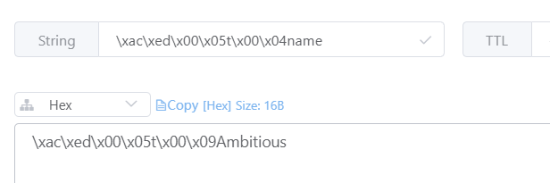

# Spring-Data-Redis

## 1. 入门案例

### 1.1 创建SpringBoot工程，引入相关依赖

```xml
<dependencies>
    <!--jedis-->
    <dependency>
        <groupId>redis.clients</groupId>
        <artifactId>jedis</artifactId>
    </dependency>
    <dependency>
        <groupId>org.springframework.boot</groupId>
        <artifactId>spring-boot-starter-data-redis</artifactId>
        <exclusions>
            <!--移除掉lettuce依赖，使用jedis-->
            <exclusion>
                <groupId>io.lettuce</groupId>
                <artifactId>lettuce-core</artifactId>
            </exclusion>
        </exclusions>
    </dependency>
    <!--测试-->
    <dependency>
        <groupId>org.springframework.boot</groupId>
        <artifactId>spring-boot-starter-test</artifactId>
    </dependency>
    <!--json-->
    <dependency>
        <groupId>com.fasterxml.jackson.core</groupId>
        <artifactId>jackson-databind</artifactId>
    </dependency>
</dependencies>
```

### 1.2 配置Redis

- 在配置文件application.yml中配置连接信息

```yaml
spring:
  redis:
    connect-timeout: 20000  # 超时时间
    host: 192.168.40.130  # 主机地址
    port: 6379  # 端口号
    jedis:
      pool:
        max-idle: 20  # 最大空闲连接数
        min-idle: 10  # 最小空闲连接数
```

- 创建配置类，实例化一个RedisTemplate对象

```java
@Configuration
public class RedisConfig {

    // jedis连接工厂
    @Autowired
    private JedisConnectionFactory connectionFactory;

    /**
     * redis模板
     */
    @Bean
    public RedisTemplate<String, Object> redisTemplate() {
        RedisTemplate<String, Object> template = new RedisTemplate<>();
        template.setConnectionFactory(connectionFactory);
        return template;
    }
}
```

### 1.3 测试

```java
@SpringBootTest
public class RedisTest {

    @Autowired
    public RedisTemplate redisTemplate;

    @Test
    public void testSave() {
        ValueOperations operations = redisTemplate.opsForValue();
        operations.set("name", "Ambitious");
    }
}
```

运行测试之后可以看到，数据被成功存储到redis服务器中，但是数据全都变成二进制的形式

这是因为SpringDataRedis在将数据存储到Redis之前，会使用序列化器将数据序列化之后再进行存储

而默认使用的jdk序列化器就是将数据序列化成二进制的形式



### 1.4 设置序列化器

在实例化RestTemplate时可以设置序列化器

```java
@Bean
public RedisTemplate<String, Object> redisTemplate() {
    RedisTemplate<String, Object> template = new RedisTemplate<>();
    template.setConnectionFactory(connectionFactory);
    template.setKeySerializer(new StringRedisSerializer());
    template.setValueSerializer(new StringRedisSerializer());
    return template;
}
```

重新运行测试，再保存一条数据

```java
@Test
public void testSave() {
    ValueOperations operations = redisTemplate.opsForValue();
    operations.set("name1", "Ambitious1");
}
```


