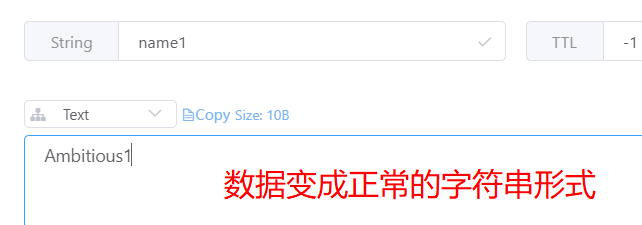

# Spring-Data-Redis

## 1. 入门案例

### 1.1 创建SpringBoot工程，引入相关依赖

```xml
<dependencies>
    <!--jedis-->
    <dependency>
        <groupId>redis.clients</groupId>
        <artifactId>jedis</artifactId>
    </dependency>
    <dependency>
        <groupId>org.springframework.boot</groupId>
        <artifactId>spring-boot-starter-data-redis</artifactId>
        <exclusions>
            <!--移除掉lettuce依赖，使用jedis-->
            <exclusion>
                <groupId>io.lettuce</groupId>
                <artifactId>lettuce-core</artifactId>
            </exclusion>
        </exclusions>
    </dependency>
    <!--测试-->
    <dependency>
        <groupId>org.springframework.boot</groupId>
        <artifactId>spring-boot-starter-test</artifactId>
    </dependency>
    <!--json-->
    <dependency>
        <groupId>com.fasterxml.jackson.core</groupId>
        <artifactId>jackson-databind</artifactId>
    </dependency>
</dependencies>
```

### 1.2 配置Redis

- 在配置文件application.yml中配置连接信息

```yaml
spring:
  redis:
    connect-timeout: 20000  # 超时时间
    host: 192.168.40.130  # 主机地址
    port: 6379  # 端口号
    jedis:
      pool:
        max-idle: 20  # 最大空闲连接数
        min-idle: 10  # 最小空闲连接数
```

- 创建配置类，实例化一个RedisTemplate对象

```java
@Configuration
public class RedisConfig {

    // jedis连接工厂
    @Autowired
    private JedisConnectionFactory connectionFactory;

    /**
     * redis模板
     */
    @Bean
    public RedisTemplate<String, Object> redisTemplate() {
        RedisTemplate<String, Object> template = new RedisTemplate<>();
        template.setConnectionFactory(connectionFactory);
        return template;
    }
}
```

### 1.3 测试

```java
@SpringBootTest
public class RedisTest {

    @Autowired
    public RedisTemplate redisTemplate;

    @Test
    public void testSave() {
        ValueOperations operations = redisTemplate.opsForValue();
        operations.set("name", "Ambitious");
    }
}
```

运行测试之后可以看到，数据被成功存储到redis服务器中，但是数据全都变成二进制的形式

这是因为SpringDataRedis在将数据存储到Redis之前，会使用序列化器将数据序列化之后再进行存储

而默认使用的jdk序列化器就是将数据序列化成二进制的形式


### 1.4 设置序列化器

在实例化RestTemplate时可以设置序列化器

```java
@Bean
public RedisTemplate<String, Object> redisTemplate() {
    RedisTemplate<String, Object> template = new RedisTemplate<>();
    template.setConnectionFactory(connectionFactory);
    template.setKeySerializer(new StringRedisSerializer());
    template.setValueSerializer(new StringRedisSerializer());
    return template;
}
```

重新运行测试，再保存一条数据

```java
@Test
public void testSave() {
    ValueOperations operations = redisTemplate.opsForValue();
    operations.set("name1", "Ambitious1");
}
```



## 2. 操作String类型

使用**ValueOperations**接口的实现，完成String类型的操作

### 2.1 设置一个String类型的值

```java
void set(K key, V value);
```

```java
@Test
public void testSave() {
    operations.set("name1", "Ambitious1");
}
```

### 2.2 设置一个String类型的值，并指定有效时间

- 设定时间到达之后这个值会自动消失
- `long timeout`：过期时间（数值）
- `TimeUnit unit`：过期时间（单位）

```java
void set(K key, V value, long timeout, TimeUnit unit);
```

```java
@Test
public void testSave1() {
    // 设置数据10秒后过期
    operations.set("name2", "Ambitious2", 10, TimeUnit.SECONDS);
}
```

### 2.3 当一个key存在时，不执行操作；反之进行存储

```java
Boolean setIfAbsent(K key, V value);
```

```java
@Test
public void testSave2() {
    Boolean isSuccess = operations.setIfAbsent("name2", "ambitious2");
    System.out.println(isSuccess);
}
```

### 2.4 当一个key存在时，往其值末尾进行补充；反之执行保存操作

返回的整型值是执行完成之后，当前key对应的value有多少个字符

```java
Integer append(K key, String value);
```

### 2.5 一次性存储多个值

```java
void multiSet(Map<? extends K, ? extends V> map);
```

```java
@Test
public void testSave4() {
    Map<String, String> map = new HashMap<>();
    map.put("name4", "嘻嘻嘻");
    map.put("name5", "啊啊啊");
    map.put("name6", "呵呵呵");
    operations.multiSet(map);
}
```

### 2.6 String类型的其他操作

```java
@Test
public void testOther() {
    // 获取某个key对应的值
    String name = operations.get("name1");
    System.out.println(name);

    // 获取某个key的值，并截取子串，范围是闭区间[start, end]
    String name1 = operations.get("name1", 5, 7);
    System.out.println(name1);

    // 批量获取值
    List<String> keys = new ArrayList<>(Arrays.asList("name2", "name3", "name4"));
    List<String> values = operations.multiGet(keys);
    for (String value : values) {
        System.out.println(value);
    }

    // 自增
    operations.set("age", "18");
    // 自增1
    operations.increment("age");
    System.out.println(operations.get("age"));
    // 自定义自增大小
    operations.increment("age", 20);
    System.out.println(operations.get("age"));
    // 自减
    operations.decrement("age");
    System.out.println(operations.get("age"));

    // 删除
    redisTemplate.delete("age");
    System.out.println(operations.get("age"));
}
```

## 3. 操作Hash类型

Hash类型用来存储**对象**数据，在使用前需要同样需要**指定序列化器**

```java
@Bean
public RedisTemplate<String, Object> redisTemplate() {
    RedisTemplate<String, Object> template = new RedisTemplate<>();
    template.setConnectionFactory(connectionFactory);
    template.setKeySerializer(new StringRedisSerializer());
    template.setValueSerializer(jackson2JsonRedisSerializer());
    // 设置Hash序列化器
    template.setHashKeySerializer(new StringRedisSerializer());
    template.setHashValueSerializer(jackson2JsonRedisSerializer());
    return template;
}

@Bean
public Jackson2JsonRedisSerializer jackson2JsonRedisSerializer() {
    Jackson2JsonRedisSerializer<Object> serializer = new Jackson2JsonRedisSerializer<>(Object.class);
    ObjectMapper mapper = new ObjectMapper();
    serializer.setObjectMapper(mapper);
    return serializer;
}
```

要保存的实体类必须实现Serializable接口

如果实体类中使用到了Java8提供的时间类型（LocalDate, LocalTime, LocalDateTime），则需要提供相应的序列化器和反序列化器，具体步骤如下：

引入jackson-datatype-jsr310依赖

```xml
<!-- 支持Java8的时间对象序列化 -->
<dependency>
    <groupId>com.fasterxml.jackson.datatype</groupId>
    <artifactId>jackson-datatype-jsr310</artifactId>
</dependency>
```

在相应的属性上方添加注解

```java
@JsonSerialize(using = LocalDateTimeSerializer.class)
@JsonDeserialize(using = LocalDateTimeDeserializer.class)
private LocalDateTime createTime;
```

### 3.1 保存数据

```java
@Test
public void testPut() {
    // 保存一个对象
    Article article = new Article();
    article.setAuthor("Ambitious");
    article.setTitle("这是一篇好文章");
    article.setCreateTime(LocalDateTime.now());
    operations.put("ARTICLE_KEY", "1", article);
    // 保存多个对象 operations.putAll(key, map<hashKey, object>)
    // 当不存在key时才进行保存 operations.putIfAbsent(key, hashKey, value)
}
```

由于反序列化时有的时候无法成功将读取到的数据转化成想要的实体对象

所以更好的方法是，在存储之前，先将实体对象转换成JSON字符串再进行保存

```java
@Test
public void testPut() throws JsonProcessingException {
    // 保存一个对象
    Article article = new Article();
    article.setAuthor("Ambitious");
    article.setTitle("这是一篇好文章");
    article.setCreateTime(LocalDateTime.now());
    ObjectMapper mapper = new ObjectMapper();
    String json = mapper.writeValueAsString(article);
    operations.put("ARTICLE", "1", json);
    // 保存多个对象 operations.putAll(key, map<hashKey, object>)
    // 当不存在key时才进行保存 operations.putIfAbsent(key, hashKey, value)
}
```

### 3.2 获取数据

```java
@Test
public void testGet() throws JsonProcessingException {
    // 获取某个对象的值
    String json = (String) operations.get("ARTICLE", "1");
    ObjectMapper mapper = new ObjectMapper();
    Article article = mapper.readValue(json, Article.class);
    System.out.println(article);
    // 获取某个Hash中的所有Key值
    Set<String> keys = operations.keys("ARTICLE");
    for (String key : keys) {
        System.out.println(key);
    }
    // 获取某个Hash中的所有Value
    List<Object> articles = operations.values("ARTICLE");
    for (Object o : articles) {
        Article article1 = mapper.readValue((String) o, Article.class);
        System.out.println(article1);
    }
    // 获取Hash中的所有KV， Map形式
    Map<String, Object> map = operations.entries("ARTICLE");
    System.out.println(map);
}
```

